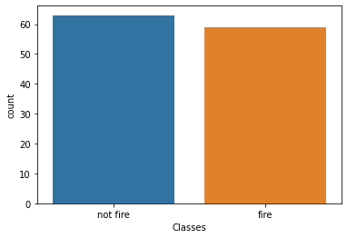

# Forest Fires Classification with Python

This is a classification project using Python and a data set on Algerian forest fires. Our goal was to use different machine learning algorithms to predict, based on the atmospheric conditions of a given day, whether or not there will be a forest fire, we then compared the accuracies of different classifiers to determine which one is best suited for this problem. The algorithms we tested were the naive Bayes, decision tree, random forest, k nearest neighbors, logistic regression, support vector machines and neural networks classifiers. The ones with the best performance were the decision tree and neural networks classifiers, which were not statistically distinct from each others according to the Tukey test.

## 1. Introduction

Forest fires are unplanned and uncontrolled fires that can destroy tens of thousands of hectares of vegetation a year, thus presenting a grave problem ecologically, economically and in terms of human life. Algeria is among the countries most afflicted by this natural disaster, specially during the summer, having lost 99061 hectares of vegetation in 2012. Our goal is, therefore, to see if machine learning algorithms can be used to predict forest fires in the Bejaia region, which would make it easier to respond to them and mitigate the damages.

The data set we will be using is the *forest_fires_bejaia.csv* file, adapted from the *Algerian_forest_fires_dataset_UPDATE.csv* file downloaded from https://archive.ics.uci.edu/ml/datasets/Algerian+Forest+Fires+Dataset++. This data set has been used to test decision tree classifiers in [Faroudja ABID et al., Predicting Forest Fire in Algeria using Data Mining Techniques: Case Study of the Decision Tree Algorithm, International Conference on Advanced Intelligent Systems for Sustainable Development (AI2SD 2019), 08-11 July, 2019, Marrakech, Morocco](https://link.springer.com/chapter/10.1007/978-3-030-36674-2_37)

## 2. Exploratory Data Analysis

Before we use our machine learning algorithms, let us explore our data. Our first step is to trim the "Classes" column, to eliminate spaces before and after the entries. Once that is done, we may proceed with the analysis.

The data accounts for 122 days, from June to September, of which 59 had fires and 63 did not.

Since we are interested in how the atmospheric conditions affect the likelihood of forest fires, we can create histograms showing how the maximum temperature, the relative humidity (RH), the wind speed (Ws) and the volume of rain behaved for days that were registered as “fire” and as “not fire”.

.png) .png)

.png) .png)

.png) .png)

.png) .png)

Additionally, we can calculate the averages of these properties for days with and without fire, from which we confirm that days with fire were characterized by higher temperatures, lower relative humidity, (slightly) lower wind speed and less rain.

## 3. Preprocessing

Our next step is to prepare the data for the machine learning algorithms. Since our data set has no null values or unexpected negative ones, there is nothing for us to fix in the data, so our fist step is to split our predicting attributes from our class (what we want to predict).

Once that is done, we must choose which of the attributes we will use with the classifiers. Since we are interested in predicting the fires using only the atmospheric conditions, we choose to keep only “temperature”, “RH”, “Wind speed” and “Rain”.

Since all the predicting attributes are numeric, there is no need to use the label encoder and the one hot encoder.

Finally, we use the standard scaler to standardize our data, since some of the classification algorithms require that all the values be in the same scale.

Once the preprocessing is done, we use pickle to save our predicting attributes and our class.

## 4. Classification Algorithms

Before we proceed with the machine learning algorithms, let summarize the procedure we will be following for each classifier.

The first step (when applicable) is the tuning of the parameters, in which we use the grid search function of the scikit-learn package to test for different train-test splits and find the parameters that will lead to the best accuracy score. The closest this score is to 1, the closest the predictions were to the real result.

After we determine the best parameters, we use cross validation to calculate the accuracy score of different train-test splits. We will use k=10, meaning that the data is going to be split in ten parts and we will alternate which one is used for testing, while the other nine are used for training. We will do this for 30 different splits, meaning that, at the end of the process, we will have 30 different values of accuracy for each algorithm, which we will use to determine how well the algorithm has performed.

### 4.1. Naive Bayes

We will begin with the naive Bayes classifier. This algorithm uses the data to create a probability table and uses it to predict which outcome is the most likely.

This algorithm has no parameters, so we skip the tuning step.

We obtain that the mean accuracy for the naive Bayes classifier is 0.820363.

### 4.2. Decision Tree

Let us now consider the decision tree classifier. This algorithm creates a "tree", with the attributes as the nodes and their values as the branches, and uses this tree to determine which class a given entry belongs to.

Tuning the parameters, we have that the best value for “criterion” is “gini”, for “min_samples_leaf” it is 1, for “min_samples_split” it is 2 and for “splitter” it is “best”.

We obtain that the mean accuracy for the decision tree classifier is 0.835321.

### 4.3. Random Forest

The next algorithm we are going to consider is the random forest classifier, which is an improvement over the decision tree one. It employs multiple different decision trees and decides based on the majority.

Tuning the parameters, we have that the best value for “criterion” is “gini”, for “min_samples_leaf” it is 5, for “min_samples_split” it is 2 and for “n_estimators” it is 10.

We obtain that the mean accuracy for the random forest classifier is 0.847436.

### 4.4. K Nearest Neighbors (kNN)

We will now consider the kNN classifier. This algorithm uses the values of the attributes of a given sample to determine the distance from it to the other samples, then assigns the new sample the same class as the majority of it’s k nearest neighbors.

Tuning the parameters, we have that the best value for “n_neighbors” is 5 and for “p” it is 1.

We obtain that the mean accuracy for the kNN classifier is 0.720021.

### 4.5. Logistic Regression

Next, let us test the logistic regression classifier, which places the entries in a graph and draws a line that approximates them, allowing it to use the line to probabilistically predict the class of the new entries.

Tuning the parameters, we have that the best value for “C” is 2, for “solver” it is “lbfgs” and for “tol” it is 0.0001. We considered a maximum of 500 iterations.

We obtain that the mean accuracy for the logistic regression classifier is 0.795598.

### 4.6. Support Vector Machines (SVM)

The SVM algorithm seeks to create hyperplanes separating entries belonging to different classes, and uses these hyperplanes to determine which class the new entries belong to.

Tuning the parameters, we have that the best value for “C” is 2, for “kernel” it is “linear” and for “tol” it is 0.001.

We obtain that the mean accuracy for the SVM classifier is 0.810748.

### 4.7. Neural Networks

The last algorithm we are going to consider is the multi-layer perceptron classifier. This algorithm was inspired by biological neural networks and works through artificial neurons, which emulate the behavior or natural neurons.

Tuning the parameters, we have that the best value for “activation” is “tanh”, for “batch_size” it is 10, for “hidden_layer_sizes” it is [100], for “solver” it is “adam” and for “tol” it is 0.001. We considered a maximum of 2000 iterations.

We obtain that the mean accuracy for the multi-layer perceptron classifier is 0.858568.

## 5. Comparing the Classifiers

Looking only at the mean accuracy for each algorithm, it would seem that the multi-layer perceptron classifier is the one best suited for this problem. However, before we conclude that, we must verify that the results we obtained for each algorithm are statistically distinct from each other. We can do this using the ANOVA and Tukey tests, which compare normally distributed sets of data.

To check if our sets are normally distributed (null hypothesis) or not (alternative hypothesis), we employ the Shapiro test with $\alpha=0.05$. That is, if the calculated p-value is smaller than 0.05, then we reject the null hypothesis. We obtain that the only set for which the distribution is not normal is the naive Bayes one. However, plotting its distribution, we can see that is is still approximately normal.

We then proceed with the ANOVA test, which will compare all of the sets and tell us if they are statistically the same (null hypothesis) or statistically distinct (alternative hypothesis). Since the p-value we obtain is much smaller than 0.05, we conclude that they are statistically distinct.

Finally, we use the Tukey test to compare each of the sets of results with each other and determine if they are statistically the same (null hypothesis) or statistically distinct (alternative hypothesis). We obtain that the two sets with the highest accuracy, the random forest one and the neural networks one, are not statistically distinct from each other. Therefore, we may choose either of these two as the best algorithm for this problem. Since the random forest algorithm is simpler and faster to execute, we choose it as the most suited classifier.

## 6. Conclusion

We used data concerning the atmospheric conditions at each day for four months to compare the performance of different classifiers in predicting forest fires in the Bejaia region of Algeria.

An initial analysis revealed that days with fire were marked by higher temperatures, lower humidity and less rain, reinforcing our assumption that these attributes can be used to predict the occurrence of forest fires..

Once the data was in a suitable form, we tested the naive Bayes, decision tree, random forest, kNN, logistic regression, SVM and neural networks classifiers. We obtained that the two algorithms with the best performance, random forest and neural networks, led to results that were not statistically distinct from each other, meaning that either of them may be chosen and the best suited classifier, although the random forest classifier, being simpler and faster, makes for a more appealing choice.
